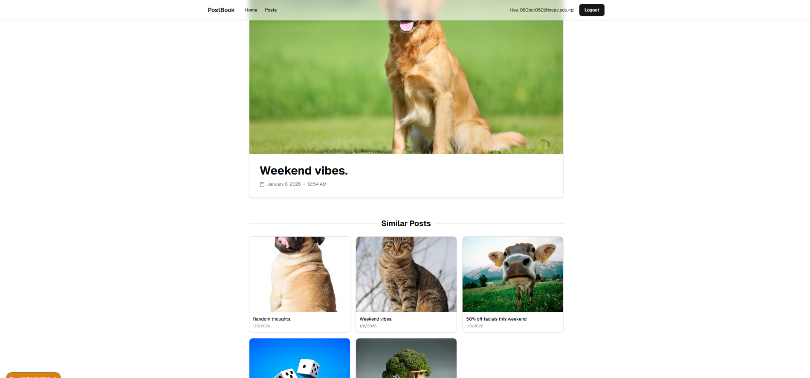

# Multimodal Social Media Post Recommendation System

A Next.js application that uses **multimodal embeddings** (text + image) to create an intelligent social media post recommendation system. Posts are indexed in **Pinecone** vector database for semantic search and similarity matching.

## Features

- 🔐 **Authentication** with Supabase Auth (password-based)
- 🖼️ **Image Upload & Storage** with local file system
- 🤖 **AI-Powered Embeddings**:
  - Text embeddings using `intfloat/multilingual-e5-large`
  - Image captioning using `Salesforce/blip-image-captioning-base`
- 🔍 **Vector Search** with Pinecone for finding similar posts
- 📊 **Late Fusion Algorithm** combining text + image similarity scores
- ✏️ **CRUD Operations** for posts with smart embedding updates
- 🎨 **Modern UI** with Tailwind CSS and shadcn/ui components

## Tech Stack

- **Framework**: Next.js 14 (App Router)
- **Authentication**: Supabase Auth
- **Database**: Prisma ORM
- **Vector Database**: Pinecone
- **AI/ML**: Hugging Face Inference API, Bytez API
- **Styling**: Tailwind CSS, shadcn/ui
- **Language**: TypeScript

---

## Setup Steps

### 1. Clone the Repository

```bash
git clone <repository-url>
cd supabase_auth_demo
```

### 2. Install Dependencies

```bash
npm install
```

### 3. Configure Environment Variables

Create a `.env.local` file in the root directory with the following variables:

```env
# Supabase Configuration
NEXT_PUBLIC_SUPABASE_URL=your_supabase_project_url
NEXT_PUBLIC_SUPABASE_ANON_KEY=your_supabase_anon_key

# Frontend URL (for image access)
NEXT_PUBLIC_FRONTEND_URL=http://localhost:3000

# Hugging Face API (for text embeddings)
HF_API_KEY=your_huggingface_api_key

# Bytez API (for image captioning)
BYTEZ_API_KEY=your_bytez_api_key

# Pinecone Configuration
PINECONE_API_KEY=your_pinecone_api_key
PINECONE_INDEX_NAME=your_index_name
PINECONE_INDEX_HOST=your_index_host
```

**Where to get these keys:**
- **Supabase**: Create a project at [supabase.com](https://supabase.com)
- **Hugging Face**: Get API key from [huggingface.co/settings/tokens](https://huggingface.co/settings/tokens)
- **Bytez**: Sign up at [bytez.com](https://bytez.com) for API access
- **Pinecone**: Create an index at [pinecone.io](https://www.pinecone.io/)
  - Use dimension: **1024**
  - Metric: **cosine**

### 4. Setup Database

```bash
# Generate Prisma client
npx prisma generate

# Run database migrations
npx prisma db push
```

### 5. Create Pinecone Index

In your Pinecone dashboard:
1. Create a new index with name matching `PINECONE_INDEX_NAME`
2. Set dimension to **1024**
3. Choose **cosine** as the metric
4. Create two namespaces:
   - `text-namespace` (for text embeddings)
   - `image-namespace` (for image embeddings)

### 6. Run Development Server

```bash
npm run dev
```

Visit [http://localhost:3000](http://localhost:3000) to see the application.

### 7. (Optional) Expose Locally with ngrok

For image captioning API to access local images:

```bash
ngrok http 3000
```

Update `NEXT_PUBLIC_FRONTEND_URL` in `.env.local` with the ngrok URL.

---

## How Embeddings are Generated & Stored in Pinecone

### Embedding Generation Process

#### 1. **Text Embeddings**
When a post is created or updated with a new caption:

```typescript
// Text embedding using Hugging Face
const textEmbedding = await createTextEmbedding(caption);
// Uses: intfloat/multilingual-e5-large model
// Output: 1024-dimensional vector
```


#### **Text Embedding Implementation**
The `createTextEmbedding` function handles text-to-vector conversion:

```typescript
export async function createTextEmbedding(text: string) {
    //other code here

    const client = new InferenceClient(HF_API_KEY);

    const output = await client.featureExtraction({
      model: "intfloat/multilingual-e5-large",
      inputs: text,
      provider: "hf-inference",
    });

    //this just converts the type of output to number[]
    return normalizeEmbedding(output);

    //other code here

}
```

This function:
- Validates the Hugging Face API key
- Uses `intfloat/multilingual-e5-large` model for multilingual support
- Normalizes the output to ensure consistent 1024-dimensional vectors
- Includes comprehensive error handling

#### 2. **Image Embeddings**
When a post is created or updated with a new image, at first caption of that image is created after that text embedding is created of that caption.

```typescript
// Step 1: Image Captioning (convert image to text description)
const captionResult = await bytez.model("Salesforce/blip-image-captioning-base")
  .run(imageUrl);

// Step 2: Convert caption to embedding
const imageEmbedding = await createTextEmbedding(captionResult.output);
// Output: 1024-dimensional vector
```


### Storage in Pinecone

Each post creates **two vectors** stored in separate namespaces:

```typescript
// Text Vector Storage
await index.namespace("text-namespace").upsert([
  {
    id: postId,
    values: textEmbedding,      // 1024-dim vector
    metadata: { type: "text" }
  }
]);

// Image Vector Storage
await index.namespace("image-namespace").upsert([
  {
    id: postId,
    values: imageEmbedding,     // 1024-dim vector
    metadata: { 
      type: "image", 
      caption: imageCaption     // Generated image description
    }
  }
]);
```

### Similarity Search with Late Fusion

When finding similar posts:

1. **Query both namespaces** with the current post's embeddings
2. **Normalize scores** using min-max normalization
3. **Apply weights**: Text (40%) + Image (60%)
4. **Combine scores** using late fusion algorithm
5. **Rank results** by fused similarity score

```typescript
fusedScore = (TEXT_WEIGHT * normalizedTextScore) + 
             (IMAGE_WEIGHT * normalizedImageScore)
```

### Smart Embedding Updates

When editing a post:
- ✅ **Caption changed only** → Regenerate text embedding only
- ✅ **Image changed only** → Regenerate image embedding only
- ✅ **Both changed** → Regenerate both embeddings
- ✅ **Nothing changed** → No embedding generation (saves API calls)

---

## Examples & Results

### Example 1: Image similarity dominates

**Posts**
1. Image: golden retriever photo, Caption: “Weekend vibes.”
2. Image: different dog photo, Caption: “Random thoughts.”
3. Image: cat photo, Caption: “Weekend vibes.”

**Screenshot:**


---

### Example 2: Text similarity dominates

**Posts**
1. Caption: “50% off facials this weekend”
2. Caption: “Weekend facial sale — 50% off”
3. Caption: “New products are in stock”

**Screenshot:**


---

### Example 3: Image + text together

**Posts**
1. Image: matcha latte, Caption: “New matcha latte is here”
2. Image: matcha drink, Caption: “Try our new matcha latte”
3. Image: latte art, Caption: “Cold brew is back”

**Screenshot:**


---

## Project Structure

```
src/
├── app/
│   ├── api/
│   │   ├── posts/              # Post CRUD endpoints
│   │   └── auth/               # Authentication callbacks
│   ├── posts/                  # Post pages (list, detail, new, edit)
│   └── auth/                   # Auth pages (login, signup)
├── components/
│   ├── posts/                  # Post-related components
│   └── ui/                     # shadcn/ui components
├── server/
│   └── actions/
│       ├── posts.ts            # Post operations with embeddings
│       ├── embeddings.ts       # Embedding generation
│       └── pinecone.ts         # Pinecone vector operations
├── lib/
│   ├── prisma.ts               # Prisma client
│   └── supabase/               # Supabase client configuration
└── types/                      # TypeScript type definitions
```

---

## API Endpoints

### Posts
- `GET /api/posts` - List all posts
- `POST /api/posts` - Create new post (with embeddings)
- `GET /api/posts/[id]` - Get single post
- `PUT /api/posts?id=[id]` - Update post (smart embedding updates)
- `DELETE /api/posts?id=[id]` - Delete post

### Authentication
- `POST /api/auth/callback` - Supabase auth callback
- `GET /api/auth/confirm` - Email confirmation

---

## Key Features Explained

### 1. Authentication Flow
- Password-based auth with Supabase
- Protected routes via middleware
- Session management with cookies

### 2. Post Creation Flow
1. User uploads image + caption
2. Image saved to `/public/uploads/`
3. Text embedding generated from caption
4. Image captioning → embedding generated
5. Both vectors stored in Pinecone
6. Post metadata saved in database

### 3. Similarity Recommendation Flow
1. Fetch embeddings for current post from Pinecone
2. Query both namespaces for similar vectors (top 20 candidates)
3. Normalize similarity scores (0-1 range)
4. Apply late fusion with weights (60% text, 40% image)
5. Rank by combined score
6. Return top 6 most similar posts

---

## Future Improvements

- [ ] Add user profiles with avatars
- [ ] Implement likes and comments
- [ ] Support video posts with temporal embeddings
- [ ] Add real-time updates with Supabase subscriptions
- [ ] Implement hashtag extraction and trending
- [ ] Add advanced filters (date, user, similarity threshold)
- [ ] Deploy to production (Vercel + cloud storage)

---

## License

MIT

---

## Contributing

Contributions are welcome! Please open an issue or submit a pull request.

---

## Acknowledgments

- [Supabase](https://supabase.com) for authentication
- [Pinecone](https://www.pinecone.io/) for vector database
- [Hugging Face](https://huggingface.co) for embedding models
- [Bytez](https://bytez.com) for image captioning
- [shadcn/ui](https://ui.shadcn.com) for UI components
